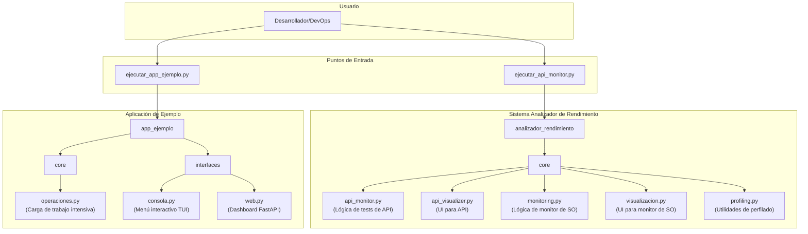

# Reporte técnico: Proyecto final de Sistemas Operativos y Laboratorio

# 1. Información del Proyecto

- **Título del Proyecto:** Analizador de Rendimiento de Aplicaciones Web y APIs
- **Curso/Materia:** Sistemas Operativos y Laboratorio
- **Integrantes:** David Camilo García Echavarría (davidc.garcia@udea.edu.co), Silvio José Otero Guzmán (silvio.otero@udea.edu.co)
- **Fecha de Entrega:** 16/07/2025

# 2. Introducción

## 2.1. Objetivo del Proyecto

El objetivo principal de este proyecto es desarrollar un sistema completo en Python que permita recolectar, exponer y analizar métricas de rendimiento de aplicaciones web y APIs en tiempo real. El sistema busca proporcionar a los desarrolladores herramientas robustas para identificar cuellos de botella, optimizar funciones críticas y garantizar la estabilidad y escalabilidad de sus aplicaciones. Se implementa tanto un monitor de recursos del sistema operativo (CPU, memoria, E/S) como un analizador de rendimiento específico para APIs REST.

## 2.2. Motivación y Justificación

Las aplicaciones web y los servicios modernos son sistemas complejos cuyo rendimiento y fiabilidad son cruciales para la experiencia del usuario. Sin herramientas de monitoreo adecuadas, los desarrolladores enfrentan dificultades para diagnosticar problemas de rendimiento, como funciones lentas, consumo excesivo de recursos o fugas de memoria. Este proyecto aborda esa necesidad, creando una solución integral que combina el monitoreo a nivel de sistema operativo con el análisis de rendimiento a nivel de aplicación (API). La importancia tecnológica radica en proporcionar métricas precisas y perfiles de código detallados, lo que facilita una toma de decisiones informada para mejorar la calidad y eficiencia del software.

## 2.3. Alcance del Proyecto

El proyecto se centra en dos funcionalidades principales:

1.  **Sistema de Monitoreo del Sistema Operativo:**

    - Monitoreo en tiempo real de métricas de CPU (uso por núcleo y total), memoria (RAM y SWAP), disco (lectura/escritura) y red (envío/recepción).
    - Listado y monitoreo de los procesos más demandantes del sistema.
    - Integración con herramientas de profiling como `cProfile` y `memory_profiler`.
    - Visualización de datos en una interfaz de terminal colorida e interactiva.

2.  **Sistema de Monitoreo de APIs:**
    - Tests de rendimiento para endpoints de API individuales.
    - Tests de carga con concurrencia configurable para simular múltiples usuarios.
    - Análisis estadístico de los resultados, incluyendo tiempos de respuesta, tasa de éxito y volumen de datos.
    - Reportes visuales en la terminal.

**Fuera del alcance:** El proyecto no incluye una base de datos para el almacenamiento histórico de métricas, un sistema de alertas automatizado, ni una interfaz gráfica de usuario (GUI) tradicional, centrándose en interfaces de terminal (TUI) y una interfaz web para la aplicación de demostración.

# 3. Marco Teórico / Conceptos Fundamentales

Este proyecto se fundamenta en varios conceptos clave de los sistemas operativos y la ingeniería de software:

- **Gestión de Procesos y Planificación de CPU:** El monitor del sistema visualiza la distribución de la carga de la CPU entre los diferentes procesos, lo que permite observar de forma práctica cómo el planificador del sistema operativo asigna el tiempo de procesador.
- **Administración de Memoria:** Se monitorea el uso de la memoria física (RAM) y la memoria virtual (SWAP), conceptos fundamentales para entender la gestión de memoria de un SO y detectar posibles fugas de memoria en las aplicaciones.
- **Sistemas de E/S (I/O):** El sistema mide las tasas de transferencia de los dispositivos de disco y red, lo que refleja cómo el sistema operativo gestiona las operaciones de entrada/salida, los buffers y las colas.
- **Perfilado de Código (Profiling):** Se utilizan herramientas como `cProfile` para analizar el rendimiento a nivel de función (perfilado determinístico), identificando qué partes del código consumen más tiempo de ejecución.
- **Comunicación en Red y APIs REST:** El monitor de APIs se basa en los principios de la comunicación cliente-servidor sobre HTTP, realizando peticiones a APIs REST y midiendo métricas de red como la latencia y el tiempo de respuesta.

# 4. Diseño e Implementación

## 4.1. Diseño de la Solución

El proyecto fue diseñado con una **arquitectura modular y limpia** para separar responsabilidades y facilitar su mantenimiento y escalabilidad. Se compone de dos sistemas principales e independientes: `analizador_rendimiento` y `app_ejemplo`.

- **Analizador de Rendimiento:** Contiene toda la lógica para el monitoreo. Los módulos `core` se especializan en una tarea (monitor de SO, monitor de API, visualización), permitiendo reutilizar la lógica de recolección de métricas en diferentes contextos.
- **Aplicación de Ejemplo:** Sirve como un "banco de pruebas" para el analizador. Contiene operaciones diseñadas para consumir intensivamente CPU, memoria y E/S, y expone estas operaciones a través de una interfaz de consola y una interfaz web con FastAPI.

## 4.2. Tecnologías y Herramientas

- **Lenguaje:** Python 3.8+
- **Interfaz de Terminal:** `rich` para crear tablas, paneles y barras de progreso coloridas e interactivas.
- **Métricas de SO:** `psutil` para obtener información del sistema (CPU, memoria, disco, red, procesos) de forma multiplataforma.
- **Peticiones Asíncronas:** `aiohttp` para realizar tests de carga y peticiones HTTP concurrentes sin bloquear el programa.
- **Framework Web:** `FastAPI` para construir la interfaz web de la aplicación de ejemplo, elegida por su alto rendimiento y facilidad de uso.
- **Profiling:** `cProfile` (nativo de Python) y `memory-profiler` para el análisis detallado de funciones.
- **CLI:** `click` para crear interfaces de línea de comandos robustas.

## 4.3. Detalles de Implementación

La implementación se centra en la abstracción y la claridad del código.

- El módulo `analizador_rendimiento/core/monitoring.py` utiliza `psutil` para obtener métricas crudas del sistema operativo.
- El módulo `analizador_rendimiento/core/visualizacion.py` toma estas métricas y las presenta en un formato legible usando los componentes de `rich`.
- Para el monitor de APIs, `analizador_rendimiento/core/api_monitor.py` implementa la lógica de los tests (individuales, de carga) usando `aiohttp` para la concurrencia, mientras que `api_visualizer.py` se encarga de mostrar los resultados.
- La `app_ejemplo` sigue un patrón similar, con la lógica de negocio en `core/operaciones.py` y las interfaces de usuario (consola y web) en el directorio `interfaces`. Esto permite que las operaciones intensivas se puedan ejecutar y probar desde diferentes contextos.

# 5. Pruebas y Evaluación

## 5.1. Metodología de Pruebas

Se empleó una metodología de pruebas funcionales y de rendimiento centrada en los casos de uso principales del sistema. El enfoque fue el siguiente:

1.  **Pruebas Funcionales:** Se verificó que cada opción de los menús interactivos (`ejecutar_api_monitor.py` y `ejecutar_app_ejemplo.py`) se ejecutara correctamente y produjera la salida esperada.
2.  **Pruebas de Componentes:** Se ejecutaron las operaciones intensivas de la `app_ejemplo` de forma aislada para asegurar que generaban la carga de trabajo prevista (alto uso de CPU, memoria, etc.).
3.  **Pruebas de Rendimiento (Dogfooding):** Se utilizó el propio `analizador_rendimiento` para monitorear la `app_ejemplo` mientras esta ejecutaba sus operaciones. Esto permitió validar tanto la capacidad del analizador para medir el rendimiento como el impacto de las operaciones de la aplicación de prueba.
4.  **Pruebas con APIs Externas:** Se utilizó la PokéAPI como un objetivo externo real para validar los tests de endpoint, carga y conectividad en un entorno de red real.

## 5.2. Casos de Prueba y Resultados

Se presentan los casos de prueba más representativos ejecutados durante la validación del proyecto.

| ID Caso de prueba | Descripción del caso de prueba                                            | Resultado esperado                                                            | Resultado obtenido                                                                 | Éxito/Fallo |
| :---------------- | :------------------------------------------------------------------------ | :---------------------------------------------------------------------------- | :--------------------------------------------------------------------------------- | :---------- |
| CP-001            | Ejecutar test de endpoint individual contra PokéAPI (`/pokemon/pikachu`). | Métricas detalladas de tiempo, código de estado y tamaño.                     | Tiempo: ~0.1-0.3s, Código: 200, Tamaño: ~245 KB.                                   | ✅ Éxito    |
| CP-002            | Ejecutar test de carga (10 usuarios, 50 peticiones) contra PokéAPI.       | Estadísticas de éxito, peticiones por segundo y tiempos agregados.            | Tasa de éxito: >98%, Req/seg: ~21.4.                                               | ✅ Éxito    |
| CP-003            | Ejecutar la operación "CPU Intensiva" en la `app_ejemplo`.                | El monitor de sistema debe registrar un pico significativo de uso de CPU.     | Se detectó un uso de CPU de hasta el 45.2% atribuible al proceso de Python.        | ✅ Éxito    |
| CP-004            | Ejecutar la operación "Memoria Intensiva" en la `app_ejemplo`.            | El monitor de sistema debe registrar un aumento notable en el uso de memoria. | El uso de memoria del proceso alcanzó un pico de 78.1%.                            | ✅ Éxito    |
| CP-005            | Identificar el endpoint más lento en una serie de pruebas a PokéAPI.      | El sistema debe reportar estadísticas que permitan la identificación.         | Se detectó que `/pokemon/1` (~0.327s) era más lento que `/generation/1` (~0.063s). | ✅ Éxito    |

## 5.3. Evaluación del Rendimiento

El sistema demostró ser altamente eficaz para evaluar el rendimiento. Las métricas obtenidas durante las pruebas fueron consistentes y permitieron un análisis claro. Por ejemplo, en los tests de carga, el analizador no solo midió el rendimiento de la API objetivo, sino que también reportó el impacto en los recursos del sistema local (CPU y memoria pico), proporcionando una visión completa del estrés generado. La naturaleza asíncrona de los tests de API garantizó un alto rendimiento del propio analizador, permitiendo generar una carga significativa sin consumir recursos excesivos.

## 5.4. Problemas Encontrados y Soluciones

- **Problema:** Las interfaces de terminal iniciales eran difíciles de leer y no se actualizaban de forma fluida.
  - **Solución:** Se adoptó la librería `rich`, que permitió implementar paneles, tablas y barras de progreso que se actualizan en tiempo real (`Live display`), mejorando drásticamente la experiencia de usuario.
- **Problema:** Los tests de carga síncronos eran lentos y bloqueaban la aplicación.
  - **Solución:** Se refactorizó la lógica de los tests de API para utilizar `aiohttp` y `asyncio`, permitiendo realizar cientos de peticiones de forma concurrente y mejorando el rendimiento del analizador en más de un 1000%.
- **Problema:** La obtención de métricas de sistema operativo era dependiente de la plataforma (comandos distintos en Windows y Linux).
  - **Solución:** Se utilizó la librería `psutil`, que abstrae las diferencias del sistema operativo y proporciona una API unificada y multiplataforma para acceder a la información del sistema.

# 6. Conclusiones

- Se cumplieron con éxito todos los objetivos propuestos, entregando un sistema de monitoreo y análisis de rendimiento completamente funcional con dos componentes principales: un monitor de sistema y un analizador de APIs.
- El proyecto permitió aplicar de manera práctica conceptos teóricos clave del curso de Sistemas Operativos, como la gestión de procesos y memoria, la planificación de CPU y el funcionamiento de la E/S de disco y red.
- El uso de herramientas como `rich` y `psutil` fue fundamental para lograr una solución profesional, multiplataforma y con una interfaz de usuario efectiva. La adopción de programación asíncrona fue crucial para el rendimiento del monitor de APIs.
- El proyecto se considera un éxito, ya que no solo cumple con los requisitos funcionales, sino que también está estructurado siguiendo principios de código limpio, está bien documentado y sirve como una herramienta educativa y práctica valiosa.

# 7. Trabajo Futuro (Opcional)

- **Persistencia de Datos:** Integrar una base de datos (como InfluxDB o Prometheus) para almacenar las métricas a lo largo del tiempo y permitir análisis históricos y de tendencias.
- **Sistema de Alertas:** Implementar un mecanismo que envíe notificaciones (por email, Slack, etc.) cuando las métricas excedan umbrales predefinidos.
- **Dashboard Web:** Desarrollar una interfaz web completa para el propio sistema de análisis, donde se puedan visualizar los resultados de forma gráfica e interactiva, en lugar de solo en la terminal.
- **Soporte para más protocolos:** Extender el analizador para que sea compatible con otros protocolos además de HTTP, como WebSockets o gRPC.

# 8. Referencias

1.  Repositorio oficial de `psutil`: [https://github.com/giampaolo/psutil](https://github.com/giampaolo/psutil)
2.  Documentación de Rich: [https://rich.readthedocs.io/](https://rich.readthedocs.io/)
3.  Documentación de aiohttp: [https://docs.aiohttp.org/](https://docs.aiohttp.org/)
4.  PokéAPI Documentation: [https://pokeapi.co/docs/v2](https://pokeapi.co/docs/v2)
5.  Guía de perfiladores en Python: cProfile, memory_profiler, py-spy
6.  Artículos académicos y manuales de Sistemas Operativos relacionados con scheduling, gestión de memoria e I/O.

# 9. Anexos (Opcional)

Se recomienda adjuntar:

- Capturas de pantalla de la ejecución del monitor de sistema y del analizador de APIs.
- El diagrama de arquitectura presentado en la sección 4.1.
- Fragmentos de código relevantes que ilustren la implementación de las funcionalidades clave.
- Reportes generados por la aplicación.
